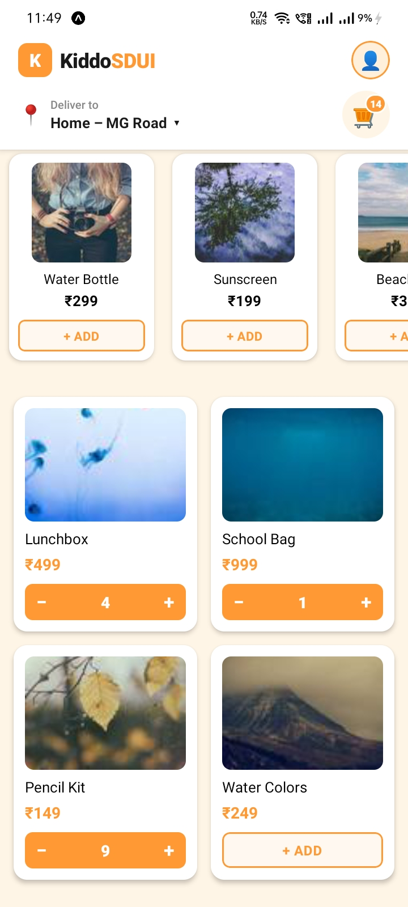

# Kiddo SDUI

| Home Screen | Cart in Action |
|:-----------:|:--------------:|
|  |  |
---

## Overview

A React Native + Expo app that renders its entire home screen dynamically from a JSON payload using a Server Driven UI (SDUI) architecture with a Component Registry, Zustand cart state, and JSON-driven theming.

---

## Features

- Dynamic JSON-driven UI rendering
- Component Registry (Factory Pattern)
- FlashList-based rendering
- Horizontal Dynamic Collections
- Universal Action Dispatcher
- Zustand Cart Store
- Theme Context
- React.memo Optimization
- Graceful handling of unknown component types
- TypeScript Strict Typing

---

## Architecture

```
homepage.json
     ↓
HomeScreen
     ↓
FlashList
     ↓
SectionRenderer
     ↓
Component Registry
     ↓
UI Components
```

---

## Tech Stack

| Technology | Purpose |
|---|---|
| React Native | Mobile UI framework |
| Expo | Development toolchain |
| TypeScript | Type safety |
| Zustand | State management (cart) |
| FlashList | Performant list rendering |

---

## Performance Optimizations

- `React.memo` — prevents unnecessary re-renders
- Stable `keyExtractor` — avoids list reconciliation overhead
- Zustand selective subscriptions — fine-grained reactivity
- FlashList virtualization — efficient large list rendering
- Component isolation boundaries — scoped re-render surfaces

---

## Supported Components

| Component | Description |
|---|---|
| `BANNER_HERO` | Full-width promotional banner |
| `PRODUCT_GRID_2X2` | 2-column product grid |
| `DYNAMIC_COLLECTION` | Horizontally scrollable item row |

---

## Unsupported Components

Unknown component types are ignored safely without crashing the application.

> **Example:** `NEW_COMPONENT_V2` — unrecognised types are skipped gracefully by the registry.

---

## Running Locally

```bash
npm install
npx expo start
```

Scan the QR code with **Expo Go** (iOS / Android) or press `a` / `i` to open on an emulator.

---

> Built as part of a Server Driven UI assignment using React Native + Expo.
